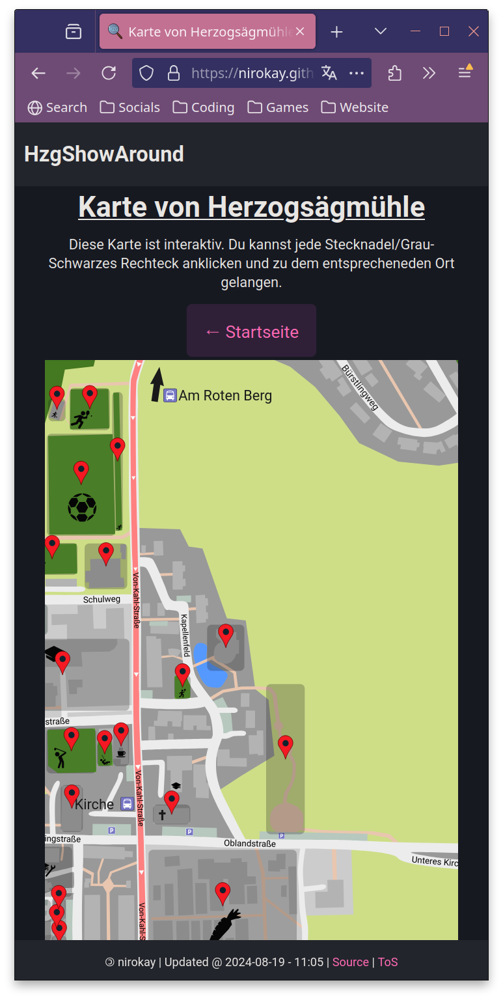

# HzgShowAround

## About

This project is a website (in german) for the sake of showing your way around
[Herzogsägmühle](https://www.herzogsaegmuehle.de/).

## Generation

**HTML** and **CSS** is generated with my own static HTML/CSS library
[websitegenerator](https://github.com/nirokay/websitegenerator).

**JavaScript** is compiled from hand-written **TypeScript** for the pages
purpose, kept at a minimum and is only used on a couple of pages. This keeps
the website lightweight and fast.

Remote data, such as location info and pictures are fetched from the
[data repository](https://github.com/nirokay/HzgShowAroundData)vat compile-time
and build-time. An active internet connection is required.

## Remote data repository

The [remote data repository](https://github.com/nirokay/HzgShowAroundData) is
used at build-time, as well as browser-time (for example:
`./javascript/newsfeed.js` with `./newsfeed.html`).

Additional documentation about locations, articles, news, etc. is available
there. That documentation is only available in German.

### Map

The map is generated using
[a template map](https://github.com/nirokay/HzgShowAroundData/blob/master/resources/images/map.svg).

The map markers and location areas/rectangles are added at build-time and the
new map is written to `./docs/resources/images/map.svg`.

Location-specific maps are just a zoomed in cutout with only that location
added. These maps are written to `./docs/resources/images/map-locations/`.

## Deployment

This repository is deployed using GitHub Pages to
[my homepage](https://nirokay.github.io/).

## Screenshots

|                   |            |                    |
|-----------------------------------------------------------------|----------------------------------------------------------------|--------------------------------------------------------------|
|                     |            |      |
|   |  |  |

## Dependencies

These are all dependencies for the entire project:

* [Nim](https://nim-lang.org/)
  * [websitegenerator](https://github.com/nirokay/websitegenerator/)
* [Typescript](https://www.typescriptlang.org/)
* [Bash](https://www.gnu.org/software/bash/)
* [Git](https://git-scm.com/) (duh...)

## Licence

This project is distributed under the **GPL-3.0** licence.
